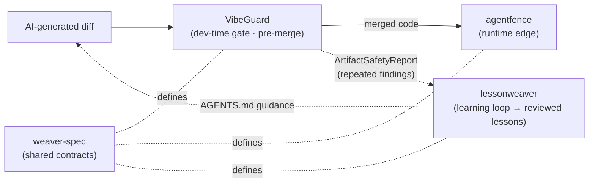

# VibeGuard

**Guardrails for vibe-coded software.**

> "AI coding tools made it cheap to generate code. They did not make it cheap to trust code."

[](https://github.com/dgenio/vibeguard/actions/workflows/ci.yml)
[](https://www.python.org/)
[](LICENSE)
[](https://pub.towardsai.net/the-weaver-stack-one-contract-layer-for-safe-llm-agents-7f733cad5eac)

Security boundary: read the [normative Trustworthy Observe threat model](docs/threat-model.md) for the exact guarantees, non-guarantees, trust assumptions, and residual-risk policy. A complete or no-findings run is **not** a security certification.

---

## Add VibeGuard to your PR workflow

**The deterministic pre-merge safety gate for AI-generated diffs** — runs in
single-digit seconds, fully offline, no API key.

**Try it locally** (full walkthrough in [Try it in 30 seconds](#try-it-in-30-seconds)):

```bash
pip install vibeguard-gate
vibeguard scan --path .
```

**Add it as a GitHub Actions PR gate** — one command generates the workflow:

```bash
vibeguard setup github-actions
```

This writes `.github/workflows/vibeguard.yml` wiring three PR surfaces in one
job: inline code-scanning annotations (SARIF), a single summary comment that
updates in place on each push, and a gate that fails the PR on high-severity
findings. Commit the file and open a PR. See
[one-command setup](docs/github-actions.md#0-one-command-setup) for options
(`--policy-pack`, `--fail-on`, `--with-config`, `--dry-run`).

Prefer to copy/paste instead? The minimal action snippet:

```yaml
# .github/workflows/vibeguard.yml
name: VibeGuard
on: [pull_request]
jobs:
  vibeguard:
    runs-on: ubuntu-latest
    steps:
      - uses: actions/checkout@v4
        with:
          fetch-depth: 0
      - uses: dgenio/vibeguard@v0.8.0
        with:
          diff: "true"
          fail-on: high
```

When a finding blocks, VibeGuard prints a severity/rule/path table and exits
non-zero — see [Example Output](#example-output). It **complements** Semgrep,
CodeQL, gitleaks, and Dependabot rather than replacing them; see the
[tool comparison guide](docs/comparison.md) for when to use it and when not to.

---

## The Problem

AI coding tools let developers ship in hours what used to take days. That is genuinely great. But accepting large AI-generated diffs without scrutiny creates a new failure mode that traditional security tools were not designed to catch:

- **Accidentally committed secrets** — API keys, tokens, and database URLs sneak in through AI-generated config files
- **Package publish leaks** — source maps, .env files, and test fixtures end up in npm/PyPI packages
- **Dependency supply chain risks** — AI agents pull in git URLs, typosquatted packages, or broad version ranges
- **Security control bypasses** — AI comments out auth checks or disables SSL verification to "make things work"
- **Risky code changes without tests** — huge diffs touching auth, crypto, and database writes with zero test coverage
- **AI footprints** — placeholder credentials, `# TODO: implement real auth`, and `trust all certificates`

## Why VibeGuard Exists

VibeGuard is **not** another AI wrapper, SAST scanner, or dependency checker.

It is a **fast, deterministic pre-merge safety gate** specifically designed for the failure modes of AI-assisted coding ("vibe coding"). It runs in seconds, works offline, and requires no API key.

Think of it as the check between "AI generated this diff" and "this diff reaches production."

## What It Catches

| Category | Examples |
|---|---|
| 🔑 **Secrets** | AWS keys, GitHub tokens, OpenAI keys, database URLs, private keys, .env files |
| 🗺️ **Source maps** | .map files in dist/, sourceMappingURL in bundles, npm packages that publish maps |
| 📦 **Packaging leaks** | .env, tests/, .github/, source maps in npm/PyPI packages |
| 🔗 **Dependency risks** | git/URL deps, typosquatted packages, unpinned versions (strict mode) |
| ⚠️ **Risky code patterns** | eval/exec, shell=True, JWT verify=False, CORS wildcard, pickle.loads, SQL construction |
| 🧪 **Missing tests** | Source changes with no corresponding test changes |
| 🤖 **AI footprints** | Placeholder creds, disabled auth, trust-all-certs, TODO stubs, temporary bypasses |
| 🐚 **Slopsquatting** | AI-hallucinated dependency names (offline heuristic + opt-in registry check) |
| 💉 **Prompt injection** | Agent-directed instructions, exfiltration directives, hidden/zero-width Unicode in comments/docs/config |

---

## Quickstart

```bash
pip install vibeguard-gate
```

Or from source:

```bash
git clone https://github.com/dgenio/vibeguard
cd vibeguard
python -m pip install -e . --group dev
```

Initialize a config file:

```bash
vibeguard init
```

Scan a directory:

```bash
vibeguard scan --path .
```

Gate your CI (exits 1 if blocking findings found):

```bash
vibeguard gate --diff --fail-on high
```

For security-sensitive repositories, add `--strict-errors` so the gate also
fails closed when the scan itself ran degraded (a rule crashed, a plugin failed
to load, git context was unavailable, or a registry lookup failed) instead of
showing a green check on a partial scan. Routine binary/oversize skips never
trip it:

```bash
vibeguard gate --diff --fail-on high --strict-errors
```

---

## Try it in 30 seconds

The repo ships two deliberately-vulnerable example packages with fake
secrets, so you can see a real, meaningful set of findings without
pointing VibeGuard at anything sensitive:

```bash
git clone https://github.com/dgenio/vibeguard
cd vibeguard
pip install -e .
vibeguard scan --path examples/vulnerable-node-package
```

You should see ~16 findings spanning secrets, source-map leaks, packaging
leaks, risky patterns, and AI footprints — none of which touch the network
or call out to any external service. Try `examples/vulnerable-python-package`
for a Python-flavored version.

To use VibeGuard as a CI gate (exits non-zero on blocking findings):

```bash
vibeguard gate --path examples/vulnerable-python-package --fail-on medium
```

No API key, no telemetry, no network calls.

Want changes that look like a real PR rather than a kitchen-sink demo? See
[`examples/pr-scenarios/`](examples/pr-scenarios) — six self-contained
scenarios (disable-TLS-to-pass-tests, temporary auth bypass, packaging leaks,
committed agent memory, git-URL dependency, risky DB write) each with the
exact command, expected findings, and a fix.

---

## CLI Reference

### `vibeguard init`

Creates a `vibeguard.yaml` config file with sensible defaults.

```bash
vibeguard init
vibeguard init --path /path/to/repo
```

### `vibeguard setup github-actions`

Generates `.github/workflows/vibeguard.yml` — a complete PR gate that uploads
SARIF for inline code-scanning annotations, posts a single self-updating summary
comment, and fails the PR on findings at/above the threshold.

```bash
vibeguard setup github-actions                       # fail-on: high
vibeguard setup github-actions --policy-pack web-app # also writes vibeguard.yaml; fail-on from pack
vibeguard setup github-actions --fail-on medium      # override the threshold
vibeguard setup github-actions --dry-run             # print the workflow, write nothing
vibeguard setup github-actions --force               # overwrite an existing workflow
```

Existing files are never overwritten without `--force`.

### `vibeguard scan`

Scans a repository and prints findings. **Always exits 0** (informational).

```bash
vibeguard scan
vibeguard scan --path .
vibeguard scan --diff                  # only changed files (requires git)
vibeguard scan --diff --base origin/develop  # compare against a non-default base
vibeguard scan --json                  # machine-readable output
vibeguard scan --markdown              # for PR comments
vibeguard scan --sarif                 # GitHub code scanning
vibeguard scan --rdjson                # reviewdog (GitHub/GitLab/Gerrit/Bitbucket)
vibeguard scan --sonar                 # SonarQube generic issue import
vibeguard scan --verbose               # detailed descriptions
vibeguard scan --fail-on medium        # set threshold (informational only)

vibeguard scan --sarif --output vibeguard.sarif   # write to a file (no shell redirection)
vibeguard gate --report sarif=vg.sarif --report pr-comment=comment.md  # several reports, one scan
```

Output formats can be written to a file with `--output PATH` (`-` = stdout), or
emitted several at once from a single scan with the repeatable
`--report FORMAT=PATH`. See [docs/output-schemas.md](docs/output-schemas.md) for
every format (including the machine-actionable `remediation` metadata and the
SARIF code-scanning result cap).

### `vibeguard gate`

Same as `scan` but **exits 1** when findings meet or exceed the threshold.

```bash
vibeguard gate --path . --fail-on high
vibeguard gate --diff --fail-on medium
vibeguard gate --diff --base origin/develop --fail-on medium
```

#### Diff-mode scope

In `--diff` mode VibeGuard reports only findings **introduced or touched by the
change set** — findings whose file is not part of the diff (pre-existing
repository state) are not reported, so a PR gate cannot be blocked by unrelated
history. The base ref is resolved as: `--base` flag → `git.base_branch` config →
automatic detection (`origin/main` → `origin/master` → `main` → `master`). When
no base can be detected the scan degrades to `git diff HEAD` and emits a visible
diagnostic — in CI use `fetch-depth: 0` (and/or `--base`) so the base branch is
available. See [docs/stability-contract.md](docs/stability-contract.md).

### `vibeguard publish-check`

Simulate `npm publish` or `python -m build` and gate on findings in the
published file set, before anything reaches the registry.

```bash
vibeguard publish-check --path .
vibeguard publish-check --ecosystem npm --manifest-out publish-manifest.json
vibeguard publish-check --ecosystem python-sdist --fail-on medium
```

See [docs/pre-publish.md](docs/pre-publish.md) for the full guide,
finding IDs, and a GitHub Actions release-gate template.

### `vibeguard explain <finding-id>`

Print a detailed explanation and remediation guide for a finding.

```bash
vibeguard explain SEC-ENV
vibeguard explain MAP-DIST
vibeguard explain TEST-MISSING
```

---

## Example Output

Below is the actual output of `vibeguard scan --path examples/vulnerable-node-package`
on this repository (regenerate with the same command if rules change):

```
                                                       VibeGuard Findings
┏━━━━━━━━━━━━┳━━━━━━━━━━━━━━━━┳━━━━━━━━━━━━━━━━━━━━━━┳━━━━━━━━━━━━━━━━━━━━━━━━━━━━━━━━━━━━━━━━━━━━━━━━━━┓
┃ Sev        ┃ Rule           ┃ Path                 ┃ Title                                              ┃
┡━━━━━━━━━━━━╇━━━━━━━━━━━━━━━━╇━━━━━━━━━━━━━━━━━━━━━━╇━━━━━━━━━━━━━━━━━━━━━━━━━━━━━━━━━━━━━━━━━━━━━━━━━━━┩
│ ☠ CRITICAL │ secrets        │ src/server.js:12     │ GitHub Token detected                              │
│ ✗ HIGH     │ secrets        │ .env                 │ Sensitive file committed: .env                     │
│ ✗ HIGH     │ sourcemaps     │ package.json         │ package.json 'files' includes source maps          │
│ ✗ HIGH     │ packaging      │ package.json         │ npm package may publish Environment files (.env)   │
│ ✗ HIGH     │ packaging      │ package.json         │ npm package may publish Source map files           │
│ ✗ HIGH     │ dependencies   │ package.json         │ URL/git/path dependency: axios                     │
│ ✗ HIGH     │ ai_footprints  │ src/server.js:14     │ AI footprint: Security disabled in code            │
│ ✗ HIGH     │ ai_footprints  │ src/server.js:31     │ AI footprint: Trust-all certificates               │
│ ✗ HIGH     │ auth           │ src/server.js:16     │ Auth: Auth bypass TODO/FIXME/HACK comment          │
│ ⚠ MEDIUM   │ packaging      │ .npmignore:8         │ Overly broad .npmignore negation: '!*'             │
│ ⚠ MEDIUM   │ risky_diff     │ src/server.js:9      │ Risk-sensitive area changed: CORS configuration    │
│ ⚠ MEDIUM   │ risky_diff     │ src/server.js:27     │ Risk-sensitive area changed: eval() or exec() usag │
│ ⚠ MEDIUM   │ risky_diff     │ src/server.js:32     │ Risk-sensitive area changed: Environment variable  │
│ ⚠ MEDIUM   │ ai_footprints  │ src/server.js:17     │ AI footprint: Temporary security bypass or mock    │
│ ↓ LOW      │ packaging      │ package.json         │ package.json runs `prepare` at publish time        │
│ ℹ INFO     │ ai_footprints  │ src/server.js:11     │ AI footprint: AI-generated code comment            │
└────────────┴────────────────┴──────────────────────┴────────────────────────────────────────────────────┘

  Scanned 5 file(s)  •  16 finding(s)  |  critical: 1  high: 8  medium: 5  low: 1  info: 1  •  policy: balanced
```

`vibeguard scan` always exits `0` (informational). `vibeguard gate` runs
the same checks but exits `1` when findings meet or exceed `--fail-on`:

```bash
vibeguard gate --path examples/vulnerable-node-package --fail-on high
echo "exit: $?"   # exit: 1
```

---

## Policy Levels

| Policy | Description |
|---|---|
| `relaxed` | Only critical and high findings |
| `balanced` | High + medium findings (default) |
| `strict` | All findings; unpinned dependencies and missing tests are elevated |

Set in `vibeguard.yaml`:

```yaml
policy: strict
fail_on: medium
```

Or override on the command line:

```bash
vibeguard gate --fail-on medium
```

---

## Configuration

Run `vibeguard init` to create a `vibeguard.yaml`:

```yaml
policy: balanced
fail_on: high

ignore:
  # gitignore-style patterns (same syntax as .vibeguardignore and .gitignore);
  # multi-segment patterns like packages/*/build/ are supported.
  paths:
    - .git/
    - node_modules/
    - .venv/
    - dist/
    - build/
  findings: []        # suppress specific finding IDs

scanner:
  max_file_size_kb: 1024
  # Honor the scan root's .gitignore by default. Git-tracked files are always
  # scanned (so a committed .env still triggers SEC-ENV); set this to false to
  # scan gitignored files too. config ignore.paths + .vibeguardignore form the
  # hard-ignore layer applied first; .gitignore only excludes additional
  # *untracked* files and cannot re-include a hard-ignored path.
  respect_gitignore: true

secrets:
  enabled: true
  min_entropy: 3.5

sourcemaps:
  enabled: true

packaging:
  enabled: true

dependencies:
  enabled: true

# `risky_patterns:` tunes the `risky_diff` rule — the YAML section name and
# the rule id differ for historical reasons. Use `vibeguard rules explain
# <rule-id>` to look up the config section for any rule.
risky_patterns:
  enabled: true

tests:
  enabled: true

ai_footprints:
  enabled: true
```

---

## GitHub Actions Usage

Add to your pull request workflow:

```yaml
name: VibeGuard
on: [pull_request]
jobs:
  vibeguard:
    runs-on: ubuntu-latest
    steps:
      - uses: actions/checkout@v4
        with:
          fetch-depth: 0
      - uses: actions/setup-python@v5
        with:
          python-version: "3.11"
      - run: pip install vibeguard-gate
      - run: vibeguard gate --diff --fail-on high
```

For local development (before publishing to PyPI):

```yaml
      - run: pip install -e .
      - run: vibeguard gate --fail-on high
```

---

## Rule quick reference

VibeGuard ships **13 deterministic rules**. Each rule emits one or more
stable finding IDs you can target with `vibeguard explain <ID>`,
suppress via `vibeguard.yaml`, or remap via `severity_overrides`.

| Rule              | Default severity | Detects                                                                                          |
|-------------------|------------------|---------------------------------------------------------------------------------------------------|
| `secrets`         | high             | AWS keys, GitHub/OpenAI/Slack/Stripe tokens, private keys, bearer tokens, hardcoded passwords, DB URLs with credentials, committed `.env` files. |
| `sourcemaps`      | high             | `.map` files in `dist/`/`build/`, `sourceMappingURL` comments, `package.json` `files` entries that include source maps. |
| `packaging`       | medium           | npm/PyPI manifests that would publish `.env`, tests, source maps, build configs; broad `MANIFEST.in` grafts, `.npmignore` negations. |
| `dependencies`    | high             | git/URL/path dependencies, typosquatting heuristics, broad version ranges, lockfile drift, registry changes. |
| `risky_diff`      | medium           | Changes to risk-sensitive areas (auth, crypto, eval/exec, shell, network, DB writes, payments, CORS, JWT, certs), framework debug artifacts (`DEBUG=True`, `ALLOWED_HOSTS=*`, `app.run(debug=True)`), plus diff-breadth/size signals. |
| `auth`            | high             | Commented-out auth, JWT `alg=none`, hardcoded admin passwords, `verify=False`, allow-all middlewares, auth functions that return `True`/`nil`. |
| `sql`             | high             | f-string / concatenation / template-literal / `fmt.Sprintf` SQL construction that smells like injection. |
| `ai_footprints`   | medium           | AI generation comments, placeholder credentials, trust-all-certs, CORS wildcards, temporary bypasses, skip-validation, hallucinated TODOs. |
| `agent_memory`    | high             | Accidentally committed agent artifacts: SQLite memory DBs, JSONL logs, transcripts, tool traces, hidden memory directories. |
| `ci_docker`       | high             | Risky Dockerfiles and GitHub Actions: privileged containers, `latest` tags, curl-pipe-bash, `pull_request_target`, broad permissions, secret echoes, unversioned actions. |
| `iac`             | high             | Terraform: IAM wildcards, open security groups, public S3, unencrypted resources. Kubernetes: privileged containers, hostPath, root user, no-TLS, allow-all policies. |
| `go_rules`        | high             | Go-specific risks: TLS bypass, shell injection, CORS wildcards, SQL via `Sprintf`, hardcoded tokens, auth bypass comments, unsafe file deletion. |
| `slopsquat`       | high             | AI-hallucinated dependencies: descriptive multi-token names absent from the lockfile, plus an opt-in registry existence/age check (network). |
| `prompt_injection`| high             | Agent-directed prompt-injection planted in comments/docstrings/markdown/config: instruction overrides, exfiltration directives, hidden/zero-width Unicode, base64 payloads. |
| `tests`           | low              | Source files changed without any corresponding test-file changes. |
| `test_integrity`  | medium           | Changes that weaken the test suite: added skip/`.only` markers, deleted test files or functions, lowered coverage thresholds (`fail_under`, `--cov-fail-under`, Jest `coverageThreshold`). |
| `lint_suppressions`| medium           | Newly introduced *blanket* suppressions: bare `# noqa`, `# type: ignore`, `/* eslint-disable */`, `@ts-ignore`/`@ts-nocheck`, bare `#nosec`, bare `//nolint`. Scoped forms with codes are not flagged. (LOW in full-scan mode and for test files.) |
| `error_handling`  | medium           | Newly introduced swallowed errors: `except: pass`/`except Exception: ...`, empty or log-only `catch {}`, discarded Go errors (`if err != nil {}`, `_ = err`). `contextlib.suppress` is treated as explicit. |

Run `vibeguard explain <finding-id>` for the full remediation guidance for any specific finding (e.g. `vibeguard explain SEC-GITHUBTOKEN`).

`risky_diff` is intentionally a **risk signal**, not a vulnerability
claim — it says "human, please look at this," not "this is exploitable."

---

## What VibeGuard is / is not

**Is:**

- A deterministic, offline pre-merge safety gate for the kinds of mistakes
  AI-assisted coding produces at scale.
- A fast first line of defense — typically runs in single-digit seconds
  on a typical repo, suitable for pre-commit hooks and PR gates.
- A tool that requires **no API key, no network calls, no telemetry**,
  and no LLM in the loop.

**Is not:**

- A full SAST replacement (use Semgrep, CodeQL, Bandit, ESLint security
  plugins for deep semantic analysis).
- A secret-scanning replacement for already-leaked credentials (use
  truffleHog or gitleaks against your full git history).
- A dependency vulnerability scanner (use Dependabot, pip-audit, npm
  audit, Snyk for CVE coverage).
- A substitute for human code review.
- A guarantee that code is safe or production-ready.

### Where VibeGuard fits next to other tools

| Tool category                     | What it's great at                       | What it tends to miss for AI-generated diffs              |
|-----------------------------------|------------------------------------------|------------------------------------------------------------|
| **VibeGuard**                     | Pre-merge gate for AI-coding failure modes (secrets in new files, packaging leaks, "trust all certs", commented-out auth, risky-diff signals). | Deep dataflow analysis, CVE lookups, historical leak scans. |
| Secret scanners (gitleaks, truffleHog) | Wide pattern coverage; can scan full git history. | A `.env` that's about to be committed *now*; secrets in newly-staged code that hasn't been pushed yet. |
| SAST (Semgrep, CodeQL, Bandit)    | Deep dataflow; community rule packs.     | "AI footprint" patterns (`# TODO: real auth`, `verify=False`, CORS wildcards) and packaging-manifest hygiene. |
| Dependency scanners (Dependabot, pip-audit, npm audit, Snyk) | Known CVEs; transitive vuln coverage. | git/URL dependencies, typosquatting heuristics, lockfile drift introduced by an AI commit. |
| Linters (ruff, eslint)            | Style + simple correctness.              | Anything security-shaped.                                 |

The intent is to **complement** these tools, not replace them. A typical
CI pipeline runs VibeGuard alongside one of each of the above.

For a deeper, per-tool breakdown — when to reach for VibeGuard and when not
to, plus a recommended layered CI pipeline — see the
[tool comparison guide](docs/comparison.md).

### Speed & false positives

VibeGuard ships a reproducible [benchmark & evaluation report](docs/benchmark.md):
scan throughput on synthetic repos, detection across Node/Python/Go/Terraform
fixtures, and a **zero blocking false-positives** baseline on clean code. Run
it yourself with `make bench` and `make bench-scenarios`.

---

## Ecosystem

VibeGuard is **fully standalone**. It has no runtime dependency on any
external service, API, or sibling project, and it never phones home. The only
thing it needs is the diff or directory you point it at.

It is built to fit *into* a broader toolchain through standard, boring
interfaces — process exit codes, JSON and SARIF reports, and editor
diagnostics — so downstream tooling can consume its findings without coupling
to VibeGuard internals. Treat those outputs as the integration surface:
nothing downstream is required for VibeGuard to do its job, and adopting
VibeGuard never forces any other tool on you.

---

## Part of the Weaver Stack

VibeGuard is the **dev-time / pre-merge guardrail** in the
[Weaver Stack](https://github.com/dgenio/weaver-spec) — a family of
independently useful tools that share contracts but never each other's
runtime. VibeGuard sits *off the runtime request path*: it gates AI-generated
diffs **before** they merge.



The connections are **standard, serialized contracts**, not coupling:

- VibeGuard's `--weaver` export emits a weaver-spec
  [`ArtifactSafetyReport`](docs/weaver/artifact_safety_report.schema.json);
  see [docs/interop-lessons.md](docs/interop-lessons.md) for how repeated
  findings become reviewed lessons in **lessonweaver**.
- **agentfence** is the runtime edge; **lessonweaver** closes the learning
  loop; **weaver-spec** holds the shared contracts.

None of this changes the promise above: VibeGuard remains **fully standalone**,
has **no runtime dependency** on any sibling, and **never phones home**. The
stack is a set of interfaces you can opt into, not a framework you have to
adopt. Repos in the stack carry the `weaver-stack` topic on GitHub.

---

## Stability & roadmap

VibeGuard is meant to be enforced in CI, so its behaviour is contractual:

- **[docs/stability-contract.md](docs/stability-contract.md)** — which
  surfaces are stable (CLI, exit codes, finding IDs, JSON/SARIF), how
  `scan` and `gate` differ, the versioning policy, and the fail-closed
  guarantees for bad paths, malformed config, and empty scans.
- **[docs/scan-scope.md](docs/scan-scope.md)** — what gets scanned in each
  mode (full, `--diff`, `--staged`, `--patch`), how file/directory targets
  resolve, and the precedence rules.
- **[docs/roadmap.md](docs/roadmap.md)** — where the project is heading
  (trust before breadth), the label taxonomy, what makes a good rule, and
  when to ship a plugin instead of a core rule.

Maintainers: see **[docs/release-checklist.md](docs/release-checklist.md)**
for the release process that keeps the README, PyPI, tags, and action
snippets aligned (`make check-versions` is the automated guard).

---

## Contributing

See [CONTRIBUTING.md](CONTRIBUTING.md) for local setup, test commands,
branch and commit conventions, and how to add a new rule.

For security disclosures, see [SECURITY.md](SECURITY.md) — do not file
public issues for vulnerabilities.

Filing a bug, feature, rule request, or false-positive? Use the
[issue forms](https://github.com/dgenio/vibeguard/issues/new/choose).

- **[docs/rules.md](docs/rules.md)** — auto-generated rule reference (`make docs` to regenerate).
- **[docs/how-to-add-a-rule.md](docs/how-to-add-a-rule.md)** — step-by-step guide for adding a built-in rule.
- **[docs/plugin-api.md](docs/plugin-api.md)** — public plugin API for shipping rules in your own package.
- **[docs/policy-packs.md](docs/policy-packs.md)** — built-in policy packs (`oss-library`, `web-app`, `strict-ci`) and source-test mapping for monorepos.
- **[docs/suppressions.md](docs/suppressions.md)** — silence findings with inline `# vibeguard: ignore` comments, policy entries, or a baseline.
- **[docs/pre-commit.md](docs/pre-commit.md)** — run VibeGuard locally via the [pre-commit](https://pre-commit.com) framework.
- **[docs/docker.md](docs/docker.md)** — run VibeGuard as a container in any CI environment.

---

## License

Apache 2.0 — see [LICENSE](LICENSE).
